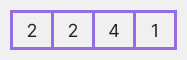

# array
##### Di c++ sebuah array adalah sebuah variabel yang bisa menyimpan banyak value dengan tipe data yang sama, sebagai contoh

Sebuah kelas mempunyai 27 murid, dan kita harus menyimpan nilai dari mereka semua. Daripada membuat 27 variabel secara terpisah untuk setiap murid, kita bisa menyederhanakannya dengan ara membuat sebuah array :
`double grade[27];`
disini, grade adalah sebuah array yang bisa menampung maksimal 27 element dari tipe data double. Di C++. ukuran dan tipe dari array tidak bisa diubah setelah deklarasinya

##### C++ array declaration
```dataType arrayName[arraySize];```

sebagai contoh :
```int myNumbers[3];```
- ```int``` adalah tipe data element yang hanya bisa dimasukan
- ```myNumbers``` adalah nama array nya
- ```[3]``` adalah ukuran dari array

##### Mengakses element-element array di C++
Di C++, setiap element di dalam sebuah array di asosiasikan dengan sebuah angka. Angka tersebut dikenal sebagai sebuah index.
Jadi kita mengakses element-element dari sebuah array menggunakan index. Intinya index itu adalah alamat dari sebuah element di dalam array.

**Syntax untuk mengakses element-element di array :**
```arrayName[index]```


[^note]:
Beberapa hal yang harus diingat :
- index array dimulai dari 0, jadi element pertama disimpan pada index ke 0
- Jika panjang dari sebuah array adalah n, maka element berakhir disimpan pada index (n-1). Pada contoh ini index element terakhir ada di index ke 4
- Element-element dari sebuah array memiliki alamat yang berurutan. Misalnya, alamat awal dari awal dari x[0] adalah 2120 .
Kemudian, alamat dari element selanjutnya dari x[1] adalah [2124], alamat dari x[2] adalah 2128, dan begitipun seterusnya.
Disini, ukuran dari setiap element meningkat jadi 4. Ini karena ukuran dari int 4 byte

##### C++ array declaration
Di C++, kita bisa menginisialisasi sebuah array pada saat deklarasinya, sebagai contoh :
method lain untuk inisialisasi array pada saat deklarasi :
```
int x[] = {2, 2, 4, 1};
```


disini, kita tidak memberi tau ukuran dari array. Di beberapa kasus, compiler secara otomatis menghitung size nya.

##### array yang memiliki slot kosong
Di C++, jika sebuah array memiliki ukuran 3, maka kita hanya bisa menyimpan sampai dengan 3 element di array. Bagaimanapun juga, apa yang akan terjadi jika kita menyimpan kuran dari 3 element di array.
```
// menyimpan hanya 1 element di array
int x[3] = {2};
```


Disini, array x mempunyai ukuran yaitu 3. Bagaimanapun juga, kita telah menginisialisasikan nya hanya 3 element.
Dalam beberapa kasus. compiler akan memasukan nilai random ke slot yang tersisa. Biasanya, nilai random ini adalah 0(nol).

##### C++ array diluar batas
```
int myNumbers[5];

// undefined behavior
cout << myNumbers[5];
cout << myNumbers[6];
```
jika kita mendeklarasikan sebuah array yang ukurannya 5, maka array akan mengandung element dari index 0-9.
Jika kita mencoba mengakses element pada index ke 5, itu akan menghasilkan undefined behavior 


**Saya membaca tutorial ini di :**
**https://www.programiz.com/cpp-programming/arrays**


